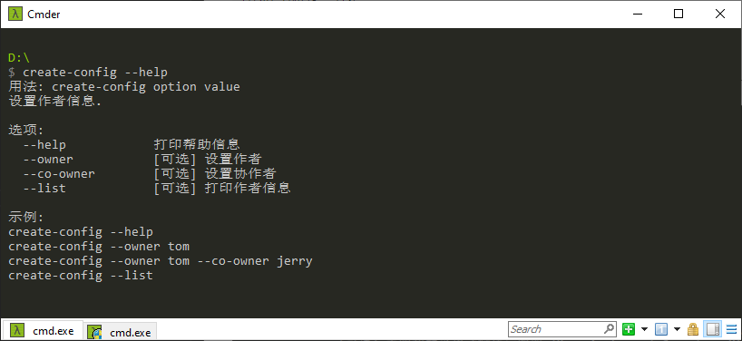
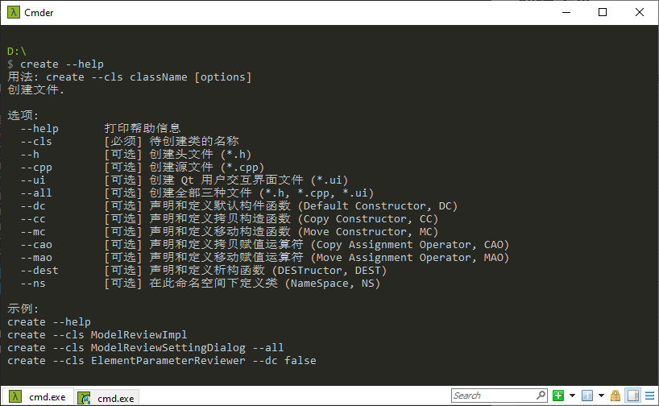

# GAP Commands CLI

## 安装

下载并安装 [node](https://nodejs.org/en/)，通过查看版本检查 node 是否安装成功。

```cmd
node --version
```

全局安装 `gap-commands-cli`，通过查看版本检查是否安装成功。

```cmd
npm install -g gap-commands-cli
gap-commands-cli --version
```

## 使用

### 作者信息



设置作者信息

```cmd
create-config --owner Tom
create-config --co-owner Jerry
```

查看作者信息

```cmd
create-config --list
```

### 创建文件



```cmd
create --cls ModelReviewImpl
create --cls ModelReviewSettingDialog --all --dc --dest
```
